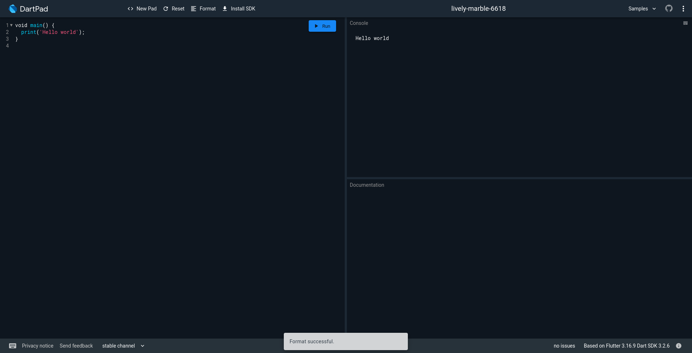

## სამუშაო გარემო
ამ კურსის განმავლობაში ჩვენ გამოვიყენებთ ონლაინ სამუშაო გარემო [DartPad](https://dartpad.dev)ს. Dartpad_ი ჩვენ საშვალებას მოგვცემს შევქმნათ და გავუშვათ დარტში დაწერილი პროგრამები ინტერნეტ ბრაუზერშივე. ლინკზე გადასვლის შემდეგ თქვენს ბრაუზერში გამოჩნდება Dartpad_ის ინტერფეისი, რომელიც სამი ძირითადი ფანჯრისაგან შედგება.


1. ფანჯარა, რომელშიც დავწერთ კოდს
2. ფანჯარა, რომელშიც ჩვენი დაწერილი პროგრამის გაშვების შედეგი დაიბეჭდება
3. ფანჯარა, რომელშიც შეგვიძლია ვნახოთ მოკლე განმარტება ჩვენს დაწერილ კოდში გამოყენებულ დარტის სინტაქსზე.

## main() ფუნქცია
ისევე როგრც ბევრ სხვა პროგრამირების ენაში, დარტში ყველა პროგრამის საწყისი არის main ფუნქცია. როდესაც ჩვენს დაწერილ კოდს "გავუშვებთ" დარტი პირველ რიგში ეცდება იპოვოს main ფუნქცია და შემდეგ შეასრულოს მასში მოთავსებული ინსტრუქციები მიყოლებით ზემოდან ქვემოთ.
ფუნქციებზე ჩვენ მომავალში ბევრს ვისაუბრებთ თუმცა მანამდე მოდით განვმარტოთ main ფუნქციის სინტაქსი.

```dart
    void main() {
    
    }
```

- სიტყვა void (keyword) დარტს ეუბნება, რომ ჩვენი დაწერილი ფუნქცია არ დააბრუნებს არანაირ მნიშვნელობას. (void - სიცარიელე)
- სიტყვა main არის ფუნქციის სახელი. როგორც წესი ფუნქციის სახელი შეგვიძლია ჩვენ შევარჩიოთ, მაგრამ main ფუნქცია განსაკუთრებულია, რადგან მას ჩვენ არ ვიძახებთ, მას გამოიძახებს დარტი. ამიტომ სახელი main სავალდებულოა. main ფუნქცია პროგრამაში უნდა იყოს მხოლოდ ერთი!
- სიმბოლოები '(' და ')' მიუთითებს ფუნქციიეს პარამეტრებზე. ფრჩხილებს შორის ფუნქციას შეგვიძლია გადავაწოდოთ ინფორმაცია(ები) ასეთის საჭიროების შემთხვევაში(ფუნქციის პარამეტრებზე კურსის მომდევნო ლექციებში კიდევ ბევრს ვისაუბრებთ)
- სიმბოლოები '{' და '}' დარტს ეუბნება, რომ ამ სიმბოლოებს შორის(ფიგურული ფრჩხილები) მოთავსებულია ფუნქციის ტანი (function body). ფუნქციის ტანი არის იმ ინსტრუქციების ერთობლიობა, რომელიც შესრულდება ამ ფუნქციის გამოძახებისას

## print() ფუნქცია
ზემოთ მოცემული პროგრამის გაშვებისას Dartpad_ის console_ი ცარიელია. ამის მიზეზი მარტივია main ფუნქცია არის ცარიელი. ამის შესაცვლელად გამოვიყენოთ კიდევ ერთი ფუნქცია. ამჯერად print ფუნქცია. main ფუნქციისაგან განსხვავებით, რომელიც ჩვენ შევქმენით, print ფუნქცია dart ში უკვე არსებობს და აქვს შესაბამისი ფუნქციონალი. (console_შე ბეჭდავს მიწოდებულ ინფორმაციას).

```dart
    void main() {
        print('Hello world');
    }
```

მოცემულ კოდის ფრაგმენტში print ფუნქციას (რომელიც თავის მხრივ main ფუნქციის ტანშია) გადავაწოდეთ პარამეტრი/ინფორმაცია 'Hello World'. მიაქციე ყურადღება რომ ტექსტი hello world მოთავსებულია ბრჭყალების სიმბოლოებს შორის. print ინსტუქციის ბოლოს დავსვით სიმბოლო - ; (წერტილ-მძიმე). დარტში წერტილ-მძიმეს დაახლოებით იგივე დანიშნულება აქვს რაც სალაპარაკო ენაში წერტილს. მიუთითებს ინსტრუქციის დასრულებაზე. წერტილ მძიმე დარტში ყველა ინსტუქციის ბოლოს უნდა დავსვათ.

## პროგრამის "გაშვება"
ჩვენი დაწერილი პროგრამის გასაშვებად შეგვიძლია გამოვიყენოთ Run ღილაკი ან კლავიშების კომბინაცია CTRL + Enter. ამის შემდეგ Dartpad_ის კონსოლში გამოჩნდება წარწერა Hello World




## ცვლადები და მონაცემის ტიპები

## String მონაცემის ტიპი

## number, int და double მონაცემის დიპები

## სავარჯიშოები

## Q&A