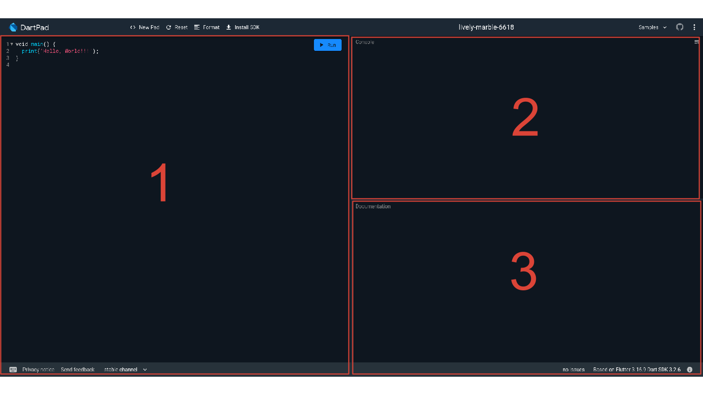

## სამუშაო გარემო
ამ კურსის განმავლობაში ჩვენ გამოვიყენებთ ონლაინ სამუშაო გარემო [DartPad](https://dartpad.dev)ს. Dartpad_ი ჩვენ საშვალებას მოგვცემს შევქმნათ და გავუშვათ დარტში დაწერილი პროგრამები ინტერნეტ ბრაუზერშივე. ლინკზე გადასვლის შემდეგ თქვენს ბრაუზერში გამოჩნდება Dartpad_ის ინტერფეისი, რომელიც სამი ძირითადი ფანჯრისაგან შედგება.

## main() ფუნქცია

## print() ფუნქცია

## პროგრამის "გაშვება"

## ცვლადები და მონაცემის ტიპები

## String მონაცემის ტიპი

## number, int და double მონაცემის დიპები

## სავარჯიშოები

## Q&A